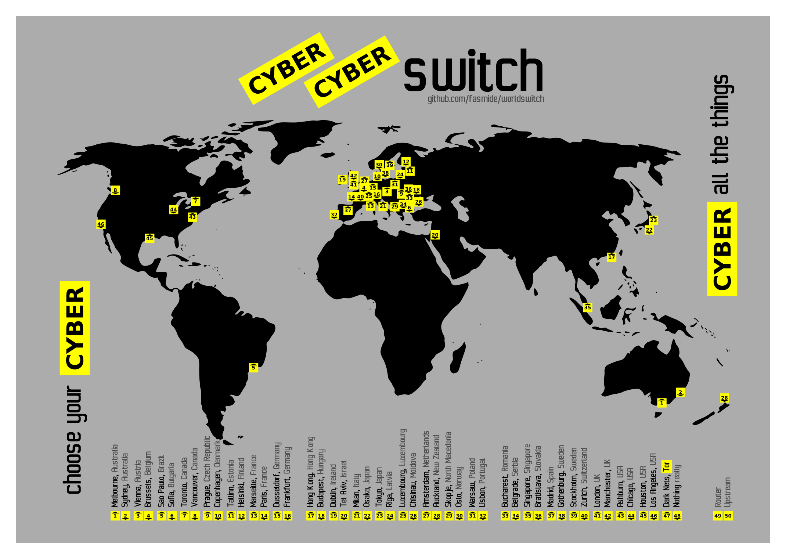
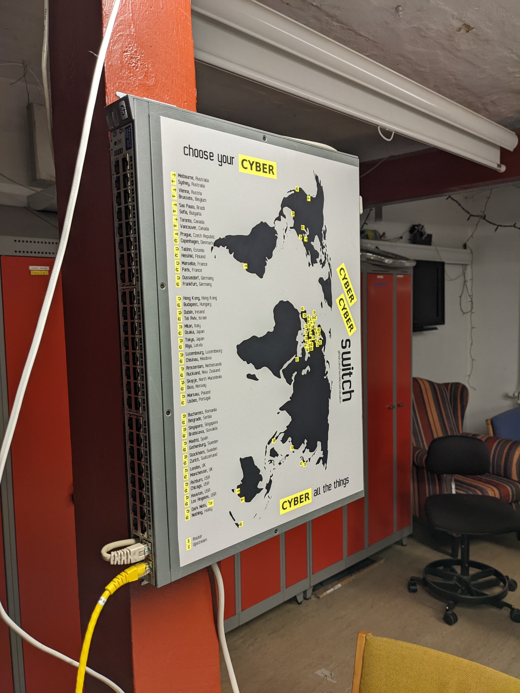
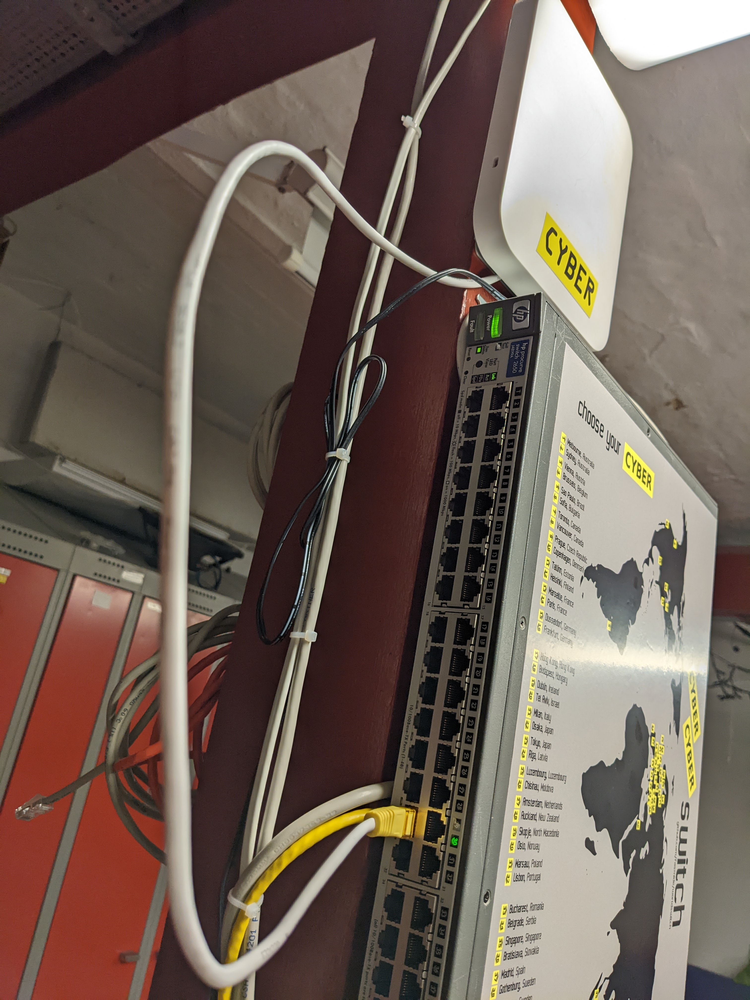

# Worldswitch
The worldswitch is a project about creating a VPN device available to the users of our local hackerspace, hal9k.dk.

Getting on the internet in another part of the world is intuitive and easy; There are 48 locations available, select a destination by plugging an ethernet cable into the desired port on the device.

No configuration is needed—no need to worry about leaking outside the tunnels.

We added an access point that can be plugged into a destination for mobile devices and other wifi-things.

## Contents
[ansible/](ansible/) for setting up the routing device - we are using a raspberry pi, but anything should do - it depends heavily on systemd but should be otherwise distro independent.

[groupvar/](groupvar/) some go code reading [ansible/group_vars/all.yml](ansible/group_vars/all.yml) and generates an updated one based on Mullvad's HTTP API.

[linkchange/](linkchange/) a go daemon running on the access point for detecting link changes and updating SSIDs accordingly.

[j4899a.config](j4899a.config) our particular switch's configuration; We Needed to configure VLANs for every port available on the switch.

[worldswitch.svg](worldswitch.svg) cyber graphics!

## Build your own
We are going to assume the reader is capable of identifying qualified old networking gear from their scrap bin:
* Some VLAN-capable switch
* Some Linux box
* Optionally an OpenWRT access point

Everything else should be included:
* Configure the switch
* Update secrets in [ansible/router.yml](ansible/router.yml)
* Run the [groupvar/](groupvar/) code for updating VPN endpoints
* Run the ansible playbook against the Linux box
* Optionally configure the access point and add the [linkchange/](linkchange/) daemon
* cyber!

## Pics or Didn't happen
 
